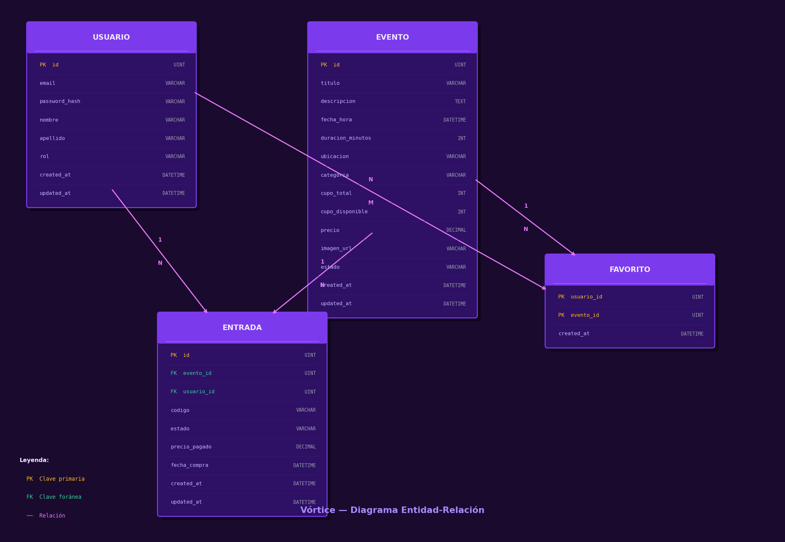

# Vórtice — Plataforma de gestión de eventos y entradas

Trabajo final de la materia **Desarrollo de Software** — Universidad Católica de Córdoba (UCC).

Vórtice es una plataforma web para la compra y gestión de entradas a eventos (música, teatro, deportes, espectáculos). Permite registrarse, explorar el catálogo de eventos, comprar entradas, cancelarlas, traspasarlas a otro usuario y marcar eventos como favoritos.

---

## Tecnologías utilizadas

### Backend
| Tecnología | Versión | Rol |
|---|---|---|
| Go | 1.23+ | Lenguaje principal |
| Gin-Gonic | v1.12 | Framework HTTP |
| GORM | v1.31 | ORM para MySQL |
| MySQL | 8.0+ | Base de datos |
| dgrijalva/jwt-go | v3.2 | Autenticación JWT |
| testify | v1.11 | Testing unitario |

### Frontend
| Tecnología | Versión | Rol |
|---|---|---|
| React | v19 | UI |
| Vite | v8 | Bundler y dev server |
| React Router DOM | v7 | Ruteo SPA |
| Axios | v1.16 | Cliente HTTP |

---

## Requisitos previos

- **Go** 1.21 o superior — [descargar](https://go.dev/dl/)
- **Node.js** 18 o superior — [descargar](https://nodejs.org/)
- **MySQL** 8.0 o superior corriendo localmente

---

## Instalación y uso

### 1. Clonar el repositorio

```bash
git clone https://github.com/isaacunaa/ticketek-ds2026.git
cd ticketek-ds2026
```

### 2. Configurar el backend

```bash
cd backend
cp .env.example .env
```

Editá el archivo `.env` con tus credenciales:

```env
DB_HOST=localhost
DB_PORT=3306
DB_USER=tu_usuario_mysql
DB_PASSWORD=tu_password_mysql
DB_NAME=ticketek
SERVER_PORT=8080
JWT_SECRET=una_clave_secreta_larga_y_segura
JWT_EXPIRATION_HOURS=24
```

### 3. Crear la base de datos MySQL

```sql
CREATE DATABASE ticketek CHARACTER SET utf8mb4 COLLATE utf8mb4_unicode_ci;
```

Las tablas se crean automáticamente al iniciar el backend mediante `AutoMigrate`. Los datos iniciales (usuarios y eventos de ejemplo) se cargan automáticamente con el seed integrado.

### 4. Correr el backend

```bash
cd backend
go run cmd/main.go
```

El servidor queda disponible en `http://localhost:8080`. El endpoint `/health` confirma que está corriendo.

### 5. Instalar dependencias e iniciar el frontend

```bash
cd frontend
npm install
npm run dev
```

La aplicación queda disponible en `http://localhost:5173`.

### 6. Correr los tests

```bash
cd backend
go test ./internal/... -cover
```

Cobertura actual: **88% en services**, **96% en controllers**.

---

## Diagrama de base de datos



---

## Decisiones de diseño

### GORM en lugar de SQL directo

Se eligió GORM como ORM para reducir el acoplamiento con MySQL y mantener la capa de acceso a datos expresada en términos del dominio del negocio. Las migraciones automáticas (`AutoMigrate`) simplifican el ciclo de desarrollo sin necesidad de mantener scripts SQL separados. El costo en flexibilidad es bajo dado el alcance del proyecto.

### Estado en lugar de eliminación física para eventos

Los eventos nunca se eliminan de la base de datos. En cambio, tienen un campo `estado` que puede ser `activo` o `cancelado`. Esto preserva la integridad referencial con las entradas vendidas: un evento cancelado sigue siendo referenciable desde las entradas ya emitidas, lo que permite auditoría y consistencia histórica de los datos.

---

## Integrantes

- Acuña
- Silvestrini
